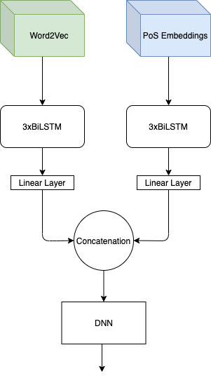

# Named Entity Recognition

The experiments on NER field let me to build the following model.
The model made use of two input, one the PoS embeddings (calculated starting from the SpaCy tool) and the Word embeddings (Word2Vec 300d from Google research)
I also tested the model using the Conditional Random Field, as shown in the table result below, I got a more higher score without it when I started using the PoS embeddings.



Check the [Report](Andrea%20Bacciu%20-%20HMW1%20Report.pdf)
 and the [Slide Presentation](presentation_slide_ner_srl.pdf) for more information.
 
# Results
| Model          | Dev F1 (%) | Test F1 (%) |
| -------------- |:------:|:------:|
| Word emb (100d) + BiLSTM  | 78.02  | 78.73 |
| Word2Vec + BiLSTM | 80.25   | 81.04 | 
| Word2Vec + BiLSTM + CRF | 88.12   | 89.76 | 
| Pos Emb + W2v + CRF | 92.11   | 92.37 | 
| **Pos Emb + W2v** | **92.20**   | **92.66** | 


## Run

*test.sh* is a simple bash script. To run it:

```sh
conda create -n nlp2020-hw1 python=3.7
conda activate nlp2020-hw1
pip install -r requirements.txt
bash test.sh data/dev.tsv
```
Actually, you can replace *data/dev.tsv* to point to a different file, as far as the target file has the same format.
